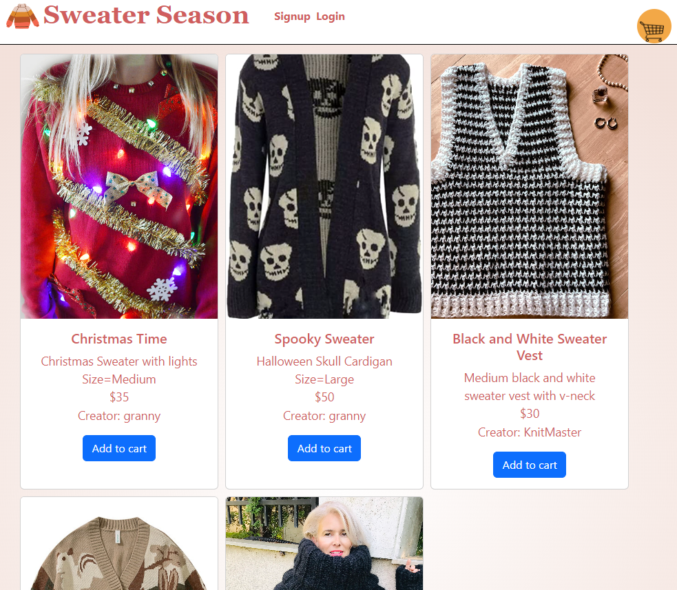
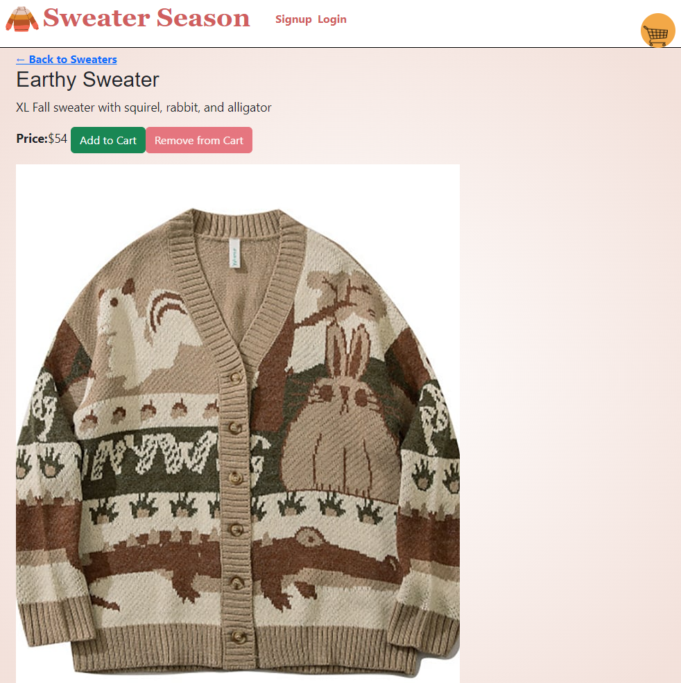
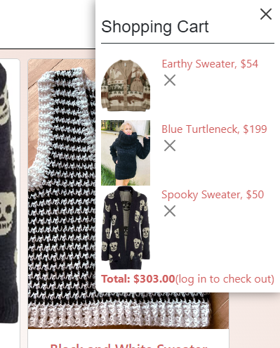

# Sweater Season

## Description

Ecommerce site to connect chilly folks with the sweater of their dreams.  Get cozy on your new fall homepage.

## User Story

As a person who would like to be cozy this fall.
I want to browse handmade sweaters and purchase them.
So that I don’t have to be cold.

-Alternatively-

As a person who makes sweaters, 
I want to create a listing for others to purchase.
So that I can make money.

## Installation

Go [here](https://github.com/fredkamm/sweater_season), and clone the repository.  Open a terminal, navigate to the folder you cloned the repo in, and run these commands:

    $ npm install
    $ npm run seed
    $ npm run build
    $ npm run develop

This will spin up a local instance of the app on [Port: 3000](http://localhost:3000/) to test while you are developing.

## Usage

Try logging in, clicking on product images to see their individual pages, adding/removing from cart.

These features are complete and functional.

## Mockups
---

### Main Page

### Item Page

### Cart

---

## Heroku Deployment

**Add Heroku Link Here**

## Credits

### Front-End Team:

[Juliet Lamond](https://github.com/jlamond37)

[Fred Kamm](https://github.com/fredkamm)

### Back-End Team:

[Travis Walborn](https://github.com/NorthernPines)

[Brian Chase](https://github.com/blchase215)